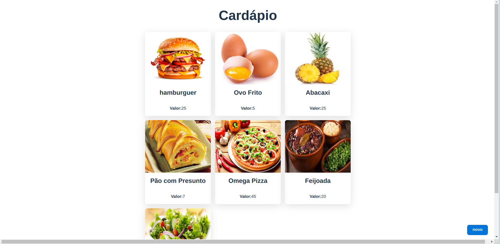
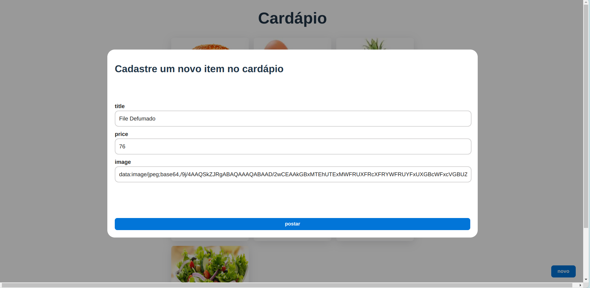

# Aplicação de Cardápio

## Descrição do Projeto

Este projeto consiste em uma aplicação de cardápio, onde os usuários podem visualizar os itens disponíveis no cardápio e também cadastrar novos alimentos. O objetivo principal deste projeto é aprender e praticar o desenvolvimento fullstack utilizando tecnologias modernas.

Agradeço à Fernanda Kipper pelo tutorial de ensino "Criando Aplicação Fullstack do Zero, Desenvolvimento do Frontend com React e Typescript", que serviu como base para a construção deste projeto.





## Backend da Aplicação de Cardápio

Este é o backend da aplicação de cardápio, responsável por lidar com as requisições relacionadas aos alimentos do cardápio.

### Tecnologias Utilizadas

- Java com Spring Boot
- Spring Data JPA
- Lombok
- Jakarta Persistence (JPA)
- Flyway
- PostgreSQL

### Estrutura do Projeto

- `controller/`: Contém os controladores REST.
- `food/`: Contém as classes relacionadas aos alimentos do cardápio.
- `CardapioApplication.java`: Classe principal.
- `ServletInitializer.java`: Configuração da aplicação como um servlet.

### Requisitos

- JDK (Java Development Kit)
- Maven
- PostgreSQL

### Configuração do Banco de Dados

Execute o seguinte comando SQL para criar a tabela necessária no banco de dados:

```sql
CREATE TABLE foods(
    id SERIAL PRIMARY KEY,
    title TEXT NOT NULL,
    price INTEGER NOT NULL,
    image TEXT
);
```

### Execução Local

1. Clone o repositório;
2. Navegue até o diretório do backend;
3. Execute/rode o projeto:

```
CardapioApplication.java
```

A aplicação estará disponível em [http://localhost:8080](http://localhost:8080).

## Frontend da Aplicação de Cardápio

Este é o frontend da aplicação de cardápio, onde os usuários podem visualizar os itens do cardápio e cadastrar novos itens.

### Tecnologias Utilizadas

- React
- CSS
- Axios
- @tanstack/react-query
- Hooks do React
- TypeScript

### Outros Pontos de Conhecimento Utilizados

- Gerenciamento de Estado e Efeitos
- Padrões de Projeto e Organização de Código

### Execução Local

Para executar o frontend localmente, siga os passos abaixo:

1. Clone este repositório;
2. Navegue até o diretório do frontend;
3. Instale as dependências:

```
npm install
```

4. Inicie o servidor de desenvolvimento:

```
npm run dev
```

---
